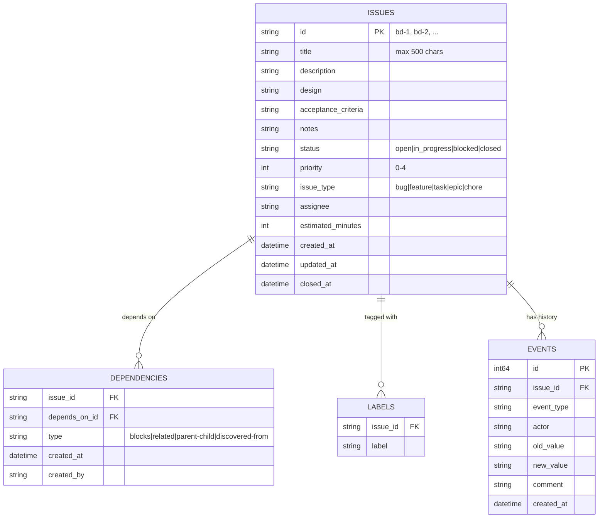

I am using beads - custom command line issue tracker to give cluade code persistent memory.
Below is ER diagram of its core data model



Following shows sample records in JSONL format

```json
{"id":"cchttpclient-1","title":"Implement error handling around http call, request/response handlers","description":"","status":"open","priority":0,"issue_type":"feature","created_at":"2025-10-14T14:04:52.330458787+05:30","updated_at":"2025-10-14T14:50:34.729551955+05:30","dependencies":[{"issue_id":"cchttpclient-1","depends_on_id":"cchttpclient-3","type":"blocks","created_at":"2025-10-14T14:07:20.841565417+05:30","created_by":"tushar"}]}
{"id":"cchttpclient-2","title":"Remove standard traceback error logging","description":"","status":"closed","priority":0,"issue_type":"feature","created_at":"2025-10-14T14:05:21.549193825+05:30","updated_at":"2025-10-14T14:50:34.734875748+05:30","closed_at":"2025-10-14T14:44:30.553135346+05:30"}
{"id":"cchttpclient-3","title":"Add HTTP status and status line when reporting error","description":"","design":"When HTTP call fails, include http status code and statusline in the error string. Attempt to ready body and append it to error if it can be stringified","status":"closed","priority":0,"issue_type":"feature","created_at":"2025-10-14T14:06:18.572280127+05:30","updated_at":"2025-10-14T14:55:18.067465629+05:30","closed_at":"2025-10-14T14:55:18.067465629+05:30"}
{"id":"cchttpclient-4","title":"Improved error handling for llm consumption","description":"","status":"open","priority":0,"issue_type":"feature","created_at":"2025-10-14T14:08:00.622367703+05:30","updated_at":"2025-10-14T14:50:34.735384958+05:30","dependencies":[{"issue_id":"cchttpclient-4","depends_on_id":"cchttpclient-1","type":"blocks","created_at":"2025-10-14T14:08:33.489890992+05:30","created_by":"tushar"},{"issue_id":"cchttpclient-4","depends_on_id":"cchttpclient-2","type":"blocks","created_at":"2025-10-14T14:08:44.668800269+05:30","created_by":"tushar"}]}
{"id":"cchttpclient-5","title":"Add API for response and request handlers to raise runtime and validation errors","description":"","status":"open","priority":0,"issue_type":"feature","created_at":"2025-10-14T14:10:33.122038046+05:30","updated_at":"2025-10-14T14:50:34.735578849+05:30","dependencies":[{"issue_id":"cchttpclient-5","depends_on_id":"cchttpclient-4","type":"blocks","created_at":"2025-10-14T14:10:51.20015225+05:30","created_by":"tushar"}]}
```

Based on above information can you write me a simple web application to show issues in visual form. Before writing actual code lets first discuss about how should be its UX. Propose me 2 choices based on its core function of issue tracking and subsequently ask me 3 questions at a time. Based on this discsussion we can collect input and select and refine the choice.

Please note that function of Issue tRacker web interface is not CRUD but let user understand current issues and its dependencies and decide what to work on next. Issues are created and updated by user or coding agent. JSON file location is `<project_root>/.beads/issues.jsonl` -> this file for all purposes should be strictly treated as READ-ONLY

So lets start